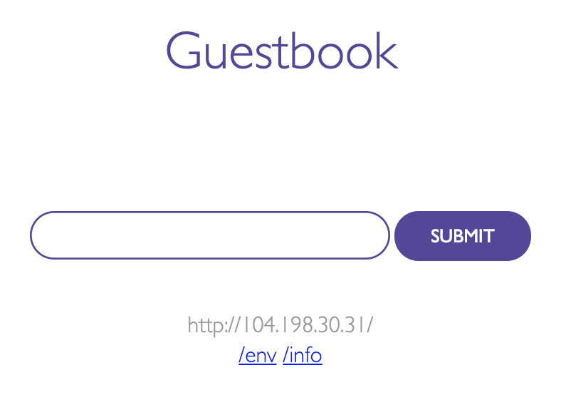

# Guest Book Application

These are the YML files to successfully deploy the 2-tier Kubernetes Guest Book application

## Getting Started

you can find additional information on this application the Kubernetes site

[Create a Guestbook with Redis and PHP](https://cloud.google.com/kubernetes-engine/docs/tutorials/guestbook)

### Prerequisites

This application was deployed in [Kubernetes Engine](https://cloud.google.com/kubernetes-engine/)

### Deploying the application

You can create a free account - [Google Cloud Platform Free Tier](https://cloud.google.com/free/)

Once your free account is setup, do:

* Create a cluster - you may name it guestbook and keep the rest to the default settings
* Activate the cloud shell terminal
* Connect to the cluster
* clone this git and cd to the directory where all yml files are store
* run the following command: kubctl create -f .
* run the following command: kubectl get services
* open the application's "external" IP in a browser

<kbd>
    
</kbd>

### Running the application

* Add names and submit
